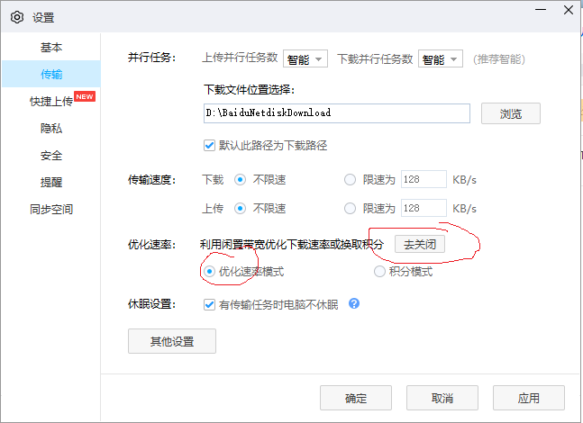
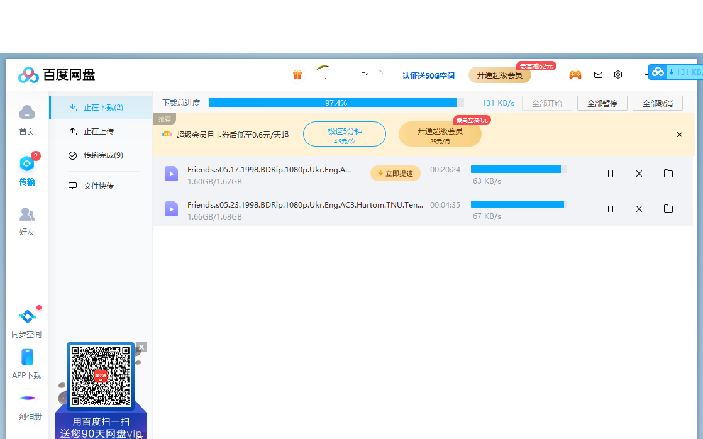
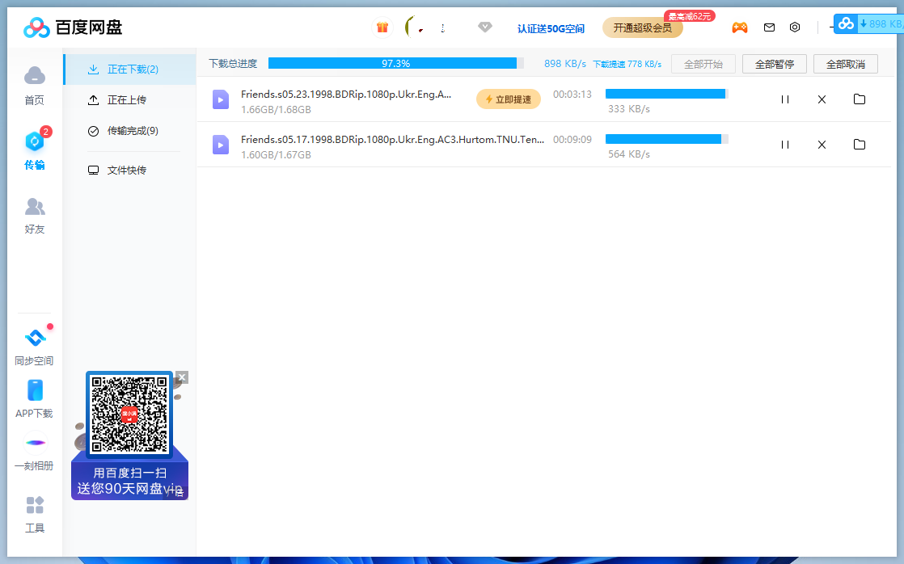
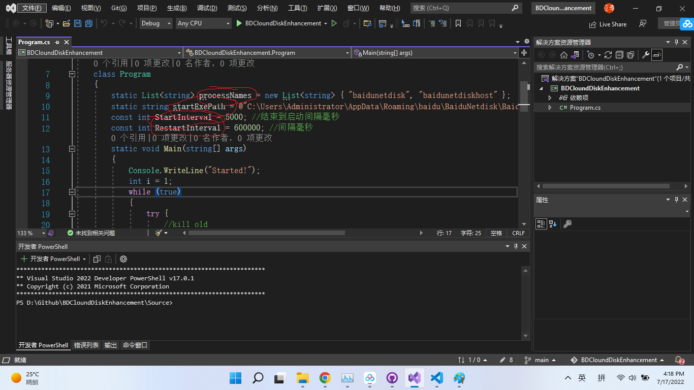

# BDCloundDiskEnhancement

## 说明




````
配置百度网盘优化模式可以解除限速，但是运行一段时间后又会重新降速，重启百度网盘后速度又恢复。
所以编写这个程序后台自动定时重新启动百度网盘,就可以提高限制速度，程序代码中主要有一下几个配置信息需要修改：
processNames 百度网盘的进程，理论上不需要修改;
startExePath 百度网盘exe的地址 默认应该是  @"C:\Users\Administrator\AppData\Roaming\baidu\BaiduNetdisk\BaiduNetdisk.exe"，具体修改为你的就可以;
StartInterval = 5000; //结束到启动间隔毫秒
RestartInterval = 600000; //重启间隔毫秒
注意要把你的百度网盘账号设置为自动登录。
本代码使用C# 和 .net core 5.0编写，开发环境VS2019你可以按你的需求修改为其他平台。
```
